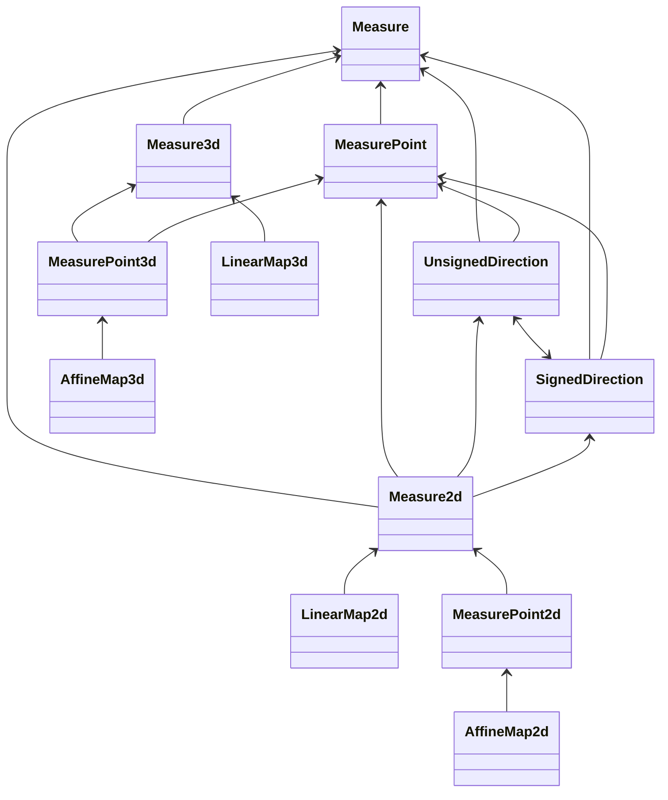

# Architecture

## Types

Here are the types that can be defined by this library:
* `Measure<Unit, Number>`: It defines generic 1-dimensional relative measures (or variations), as vectors in a 1-dimensional vector space. It has no dependencies.
* `MeasurePoint<Unit, Number>`: It defines generic 1-dimensional absolute measures (or positions), as points in a 1-dimensional affine space. It directly depends on type `Measure`.
* `UnsignedDirection<Unit, Number>`: It defines directions in a plane, as angles with a value constrained to be between 0 included and 1 cycle excluded (360°). It directly depends on types `MeasurePoint`, `SignedDirection`.
* `SignedDirection<Unit, Number>`: It defines directions in a plane, as angles with a value constrained to be between minus half cycle included (-180°) and plus half cycle excluded (+180°). It directly depends on types `MeasurePoint`, `UnsignedDirection`.
* `Measure2d<Unit, Number>`: It defines generic 2-dimensional relative measures (or variations), as vectors in a 2-dimensional vector space, having components X and Y. It directly depends on type `MeasurePoint`, `UnsignedDirection`, `SignedDirection`.
* `MeasurePoint2d<Unit, Number>`: It defines generic 2-dimensional absolute measures (or positions), as points in a 2-dimensional affine space, having components X and Y. It directly depends on type `Measure2d`.
* `Measure3d<Unit, Number>`: It defines generic 3-dimensional relative measures (or variations), as vectors in a 3-dimensional vector space, having components X, Y and Z. It directly depends on type `Measure`.
* `MeasurePoint3d<Unit, Number>`: It defines generic 3-dimensional absolute measures (or positions), as points in a 3-dimensional affine space, having components X, Y and Z. It directly depends on type `MeasurePoint`, `Measure3d`.
* `LinearMap2d<Number>`: It defines linear transformations in a plane of objects of type `Measure2d`. It directly depends on type `Measure2d`.
* `AffineMap2d<Unit, Number>`: It defines affine transformations in a plane of objects of type `MeasurePoint2d`. It directly depends on type `MeasurePoint2d`.
* `LinearMap3d<Number>`: It defines linear transformations in 3d-space of objects of type `Measure3d`. It directly depends on type `Measure3d`.
* `AffineMap3d<Unit, Number>`: It defines affine transformations in 3d-space of objects of type `MeasurePoint3d`. It directly depends on type `MeasurePoint3d`.

In addition, the following types can be defined:
* `ApproxMeasure<Unit, Number>`: Similar to `Measure<Unit, Number>`.
* `ApproxMeasurePoint<Unit, Number>`: Similar to `MeasurePoint<Unit, Number>`.
* `ApproxUnsignedDirection<Unit, Number>`: Similar to `UnsignedDirection<Unit, Number>`.
* `ApproxSignedDirection<Unit, Number>`: Similar to `SignedDirection<Unit, Number>`.
* `ApproxMeasure2d<Unit, Number>`: Similar to `Measure2d<Unit, Number>`.
* `ApproxMeasurePoint2d<Unit, Number>`: Similar to `MeasurePoint2d<Unit, Number>`.
* `ApproxMeasure3d<Unit, Number>`: Similar to `Measure3d<Unit, Number>`.
* `ApproxMeasurePoint3d<Unit, Number>`: Similar to `MeasurePoint3d<Unit, Number>`.
* `ApproxLinearMap2d<Number>`: Similar to `LinearMap2d<Unit, Number>`.
* `ApproxAffineMap2d<Unit, Number>`: Similar to `AffineMap2d<Unit, Number>`.
* `ApproxLinearMap3d<Number>`: Similar to `LinearMap3d<Unit, Number>`.
* `ApproxAffineMap3d<Unit, Number>`: Similar to `AffineMap3d<Unit, Number>`.

All of them store and use the additional field `variance`, to represent the square of the uncertainty of the values of the measure.

* `Angle`: It is a predefined measurement property. It has no dependencies.
* `Radian`: It is the only predefined unit of measurement of property `Angle`. It depends on type `Angle`.
* `Dimensionless`: It is a predefined measurement property. It has no dependencies.
* `One`: It is the only predefined unit of measurement of property `Dimensionless`. It depends on type `Angle`.

Such types and their dependencies are shown in this class diagram:

### All types


A similar diagram is obtained by adding the prefix `Approx` to every class. In addition, every class depends on the class `Measure`.

To use these types, they must be defined *inside* application code, by invoking the macro `define_measure_types`.

## Limitations

This library is not meant to support:
* An exploratory style of development. The Rust language itself was not designed for that. Those who need a more interactive environment should use an interpreted language, like Scratch, Python or Wolfram.
* Advanced theoretical physics. Modern theoretical physics uses concepts like a space with more than 3 dimensions, or with a non-Euclidean geometry.
* Quantities whose units may have a varying value, like currencies.
* Integer or fixed-point numbers.
* Arbitrary-precision numbers. Currently, the value type can be only `f32` and `f64`. Maybe that in the future a higher-precision value type will be supported, possibly having 80 or 128 bits.
* Powerful linear algebra algorithms. Currently some linear and affine transformations are supported. Maybe some others will be added, if they are simple enough.

## Why only three dimensions

This library is meant to support computations commonly performed in software used for applied science or engineering. Such systems use typically only 1, 2, or 3 dimensions to represent quantities. When more dimensions (or "degrees of freedom") are needed, the formulas become so much more complex that this library is not going to cover such multidimensional things as single variables.

## Why a macro is used

Most crates define types and allow application code to use such types by instantiating them.
Instead, the crate `measures` is essentially a single huge macro: `define_measure_types`.

Let's see why this solution has been chosen.

This library has the purpose of allowing the user to write code like the following one. First, we define some properties to measure, like `ElectricCurrent`, `ElectricCharge`, and `Time`, using these statements:
```rust
pub struct ElectricCurrent;
pub struct ElectricCharge;
pub struct Time;
```

Then, we define some units of measurement for the defined properties, like `Ampere` for `ElectricCurrent`, `Coulomb` for `ElectricCharge`, and `Second` for `Time`, using these statements:
```rust
use measures::traits::MeasurementUnit;

pub struct Ampere;
impl MeasurementUnit for Ampere {
    type Property = ElectricCurrent;
    const RATIO: f64 = 1.;
    const OFFSET: f64 = 0.;
    const SUFFIX: &'static str = " A";
}

pub struct Coulomb;
impl MeasurementUnit for Coulomb {
    type Property = ElectricCharge;
    const RATIO: f64 = 1.;
    const OFFSET: f64 = 0.;
    const SUFFIX: &'static str = " C";
}

pub struct Second;
impl MeasurementUnit for Second {
    type Property = Time;
    const RATIO: f64 = 1.;
    const OFFSET: f64 = 0.;
    const SUFFIX: &'static str = " s";
}
```

With the above definitions, we can define measures having the defined units, with these statements:
```rust
    use measures::measure1d::Measure;
    let charge = Measure::<Coulomb>::new(6.);
    let time = Measure::<Second>::new(2.);
    let current: Measure<Ampere>;
```

Though, the operations involving values of more that one property are not allowed yet. For example, the following statement, albeit reasonable, would generate a syntax error:
```rust
    current = charge / time;
```

The main error message is: ``cannot divide `Measure<Coulomb>` by `Measure<Second>` ``. A help message is: ``the trait `Div<Measure<Second>>` is not implemented for `Measure<Coulomb>` ``.

So, there is the need to implement the trait `Div<Measure<Second>>` for the type `Measure<Coulomb>`.

The Rust language specifies that *only traits defined in the current crate can be implemented for types defined outside of the crate*. So, either the trait or the type for which it is implemented must be defined in the same crate in which there is the implementation of the trait.

There are two alternatives:
1. Such trait implementation is in the library crate. In such a case, either the trait or the type are defined in our library.
2. Such trait implementation is in the application crate. In such a case, either the trait or the type are defined in our application.

The trait we are talking about is `core::ops::Div`, and so it is defined neither in our library nor in our application.

Therefore, the type for which `Div` is implemented (which is `Measure<Coulomb>`) must be completely defined either in our library or in our application.

Though, by design, we want to keep the generic type `Measure` in the library, and the concrete type `Coulomb` in the application.
So, we cannot have what we want, by using only normal Rust code.

A trick to do what we want is to have the library define a macro, which generates the definition of the generic type `Measure` and the implementation of the trait `Div` for the type `Measure<Coulomb>`.
Such macro is used is application code, and therefore we have:
* The definition of the type `Coulomb` is in application code, best if it is in a module dedicated to user-defined units of measurement.
* The definition of the generic type `Measure` is generated by the macro expansion in application code.
* Therefore, the whole concrete type `Measure<Coulomb>` is defined in application code.
* The implementation of the trait `Div` for the type `Measure<Coulomb>` is generated by the macro expansion in application code.

So, we have that the foreign trait `Div` is implemented locally for a local type; and this is allowed.

## Which arguments should be passed to the macro

The crate `measure` is designed to be used by applications needing only 1-dimensional measures, or by applications needing only 1-dimensional and 2-dimensional measures, or by applications needing also 3-dimensional measures. It would be a useless overhead to provide more dimensions than what is required.

Such overhead is probably not about runtime performance, but mainly about compiler performance and also about cognitive overload.
If the code for 2-dimensional measures is generated also for applications needing only 1-dimensional measures, means that such useless code must be compiled anyway, and the IDE should provide assistance for such unneeded types.
This is is a concept usually handled by the concept of "feature" of crates.
Though, for this library, the code to be included or not is not a feature of the crate, but some code to be generated or not by the macro inside the application.

Therefore, the macro has many options, which are quite similar to features of typical crates.
Consider that relative 1-dimension measures (belonging to a 1-dimension vector space) are essential to the library, and so they cannot be excluded.

For some applications, absolute measures (belonging to an affine space) may also be needed, and so there is the boolean option `with_points`, meaning "with absolute measures in an affine space". Typical uses are for positions, instants, temperatures.

For some applications, directions may also be needed, and so there is the boolean option `with_directions`, meaning "with signed or unsigned angles used to specify a point in a circumference".

For some applications, measures can be vectors or points in a plane, and so there is the boolean option `with_2d`, meaning "with relative (vector) measures or absolute (point) measures in a plane". Typical uses are for positions or movements, velocities, accelerations, forces, torques, electrical field, magnetic field, restricted to a plane.

For some applications, measures can be vectors or points in the 3-d space, and so there is the boolean option `with_3d`, meaning "with relative (vector) measures or absolute (point) measures in the space". Typical uses are the same as of 2d-measures, but not restricted to a plane.

For some applications, vector or affine transformations are needed. They can be provided by this library, keeping the correct units of measurements, by specifying the boolean option `with_transformations`. They can be useful for all 2-d or 3-d measures.

The simplest and most efficient measures are exact, meaning that they specify just a single value. Though, for many applications, a measure is meant to be a normal probability distribution of values. For such measures, two value are specified, a mean and a variance.

To use exact measures, there is the boolean option `exact`, meaning "with a kind of measures specifying a single value for every dimension". It is useful for any kind of measure.

To use use measures laying on a normal probability distribution, there is the boolean option `with_approx`, meaning "with a kind of measures specifying also a variance (or a standard deviation) as a specification of uncertainty". It is useful for any kind of measure.

When an arithmetic operation is applied to two measures, the uncertainty of the result depends on the means and variance of the two operands, but also on the statistical correlation of such distribution. The usual arithmetic operations assume the the distributions of the operands are statistical independent, i.e. their correlation is 0 (zero).

Sometimes, an arithmetic operation is applied to uncertain measures whose distribution has a certain non-zero correlation. Typically, the correlation can be 1 (one), meaning that whenever an operand measure has a deviation, with respect to its mean, the other operand measure has the same relative variation, with respect to its mean. So, it may be needed to specify such correlation when performing a binary operation between measures. To be able to do that, there is the boolean option `with_correlation`, which should be `true` only if `with_approx` is also `true`.
